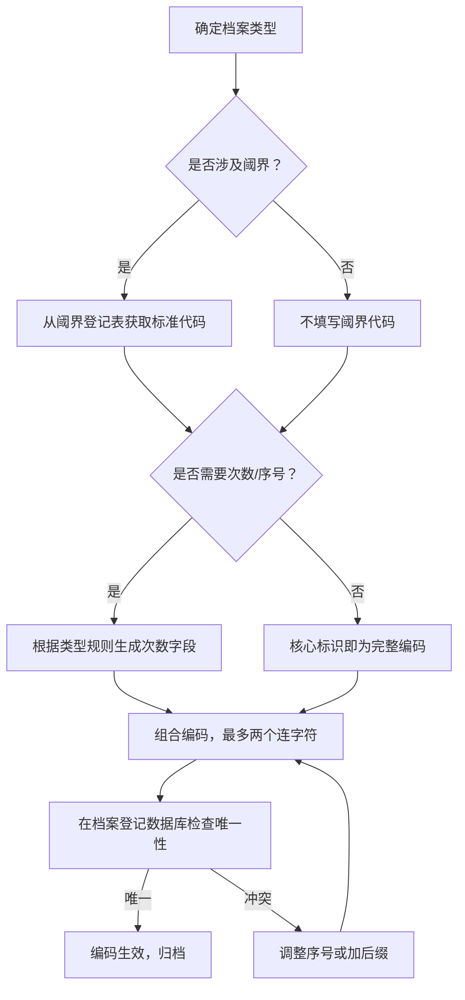

1. **协议手册**：不再使用名称+版本号，改为 `PRT-全局序号`（如 `PRT-0001`），避免长编码和多个连字符。
2. **阈界档案**：重新研判必要性。一般对象不单独建档，仅在阈界档案（`TMS-xxx`）中用描述性名称记录；仅对**特别重要**的对象建立独立 `OBJ` 档案，格式 `OBJ-阈界编号`（如需区分多个对象，可加序号如 `OBJ-阈界编号-01`）。
3. **部门代码**：全部统一为2位数字（10领导层、20外勤、30档案与研究、40医疗心理、50安全防护、60后勤、70临时/顾问、80特殊）。
4. **人事档案**：只保留一个连字符，格式 `HR-部门代码+工号`（共6位数字，如 `HR-300002`）。

同时，所有档案类型均遵循 **最多两个连字符** 的原则，保持编码简洁。

以下是完整的优化版规则（v4.0）及新旧映射表。

---

# 档案编码规则（优化版 v4.0）

**协议编码**：`PRT-0001`  
**版本**：4.0  
**制定部门**：档案与研究部  
**制定日期**：2025年9月6日  
**访问权限**：2级  
**归档状态**：封存 (Sealing)

---

## 1.0 概述

本规则在 v3.0 基础上根据总指挥批示进一步优化，主要改进：
- 协议手册使用纯序号，删除冗余的名称与版本号字段。
- 阈界档案仅针对特别重要的阈界对象，避免过度建档。
- 所有部门代码统一为数字，人事档案压缩至单个连字符。
- 整体编码长度缩短，易写易读。

**核心原则**：
- 唯一性：同一类型下，核心标识（含序号）组合唯一。
- 简洁性：最多使用两个连字符，无意义字段一律省略。
- 灵活性：仅当档案具有“第N次”或“对象序号”概念时才添加次数字段。

---

## 2.0 统一部门代码表（数字）

| 代码 | 部门                     |
|------|--------------------------|
| 10   | 领导层（最高指挥部）     |
| 20   | 外勤行动部               |
| 30   | 档案与研究部             |
| 40   | 医疗与心理部             |
| 50   | 安全与防护部             |
| 60   | 后勤与架构部             |
| 70   | 临时人员/顾问            |
| 80   | 特殊状态（退役、转调等） |

---

## 3.0 各档案类型编码规则

### 3.1 勘探/实验记录（EXP）

**格式**：`EXP-[阈界代码]-[次数]`（次数可选）

- 阈界代码：如 `L0234`，若无关可省略整个 `-阈界代码` 部分。
- 次数：仅当为第2次及以上时使用，格式 `S2`、`V3` 等（首次不写）。

**示例**：
- `EXP-L0234`：对明知山的首次勘探
- `EXP-L0234-S2`：第二次勘探
- `EXP`：无阈界关联的通用实验

### 3.2 阈界档案（OBJ）—— 仅特别重要对象

**研判原则**：  
- 一般对象（如阈界内的普通异常物品、常见实体）**不单独建档**，其信息直接在阈界档案（`TMS-xxx`）的描述字段中以 `OBJ: 描述性名称` 形式记录。  
- 仅当对象具有**独立研究价值、极高威胁、或作为重要资产**时，才建立独立 `OBJ` 档案。

**格式**：`OBJ-[阈界代码]-[对象序号]`（对象序号可选，仅当同一阈界有多个重要对象时使用2位数字）

**示例**：
- `OBJ-L0234`：明知山中的重要对象（如“不可知石碑”）
- `OBJ-O0442-01`、`OBJ-O0442-02`：回音殿堂中的两个重要共鸣水晶

### 3.3 医疗报告（MED）

**格式**：`MED-[阈界代码]`（阈界代码可选）

**示例**：
- `MED-L0734`：囤积者回廊暴露者心理评估
- `MED`：常规体检报告

### 3.4 理论文件（THY）

**格式**：`THY-[阈界代码]`（阈界代码可选）

**示例**：
- `THY-L0234`：明知山理论分析
- `THY`：通用异常理论

### 3.5 记录/日志（LOG）

**格式**：`LOG-[阈界代码]-[序号]`（序号可选，2位数字，首次不写）

**示例**：
- `LOG-L0234`：第一份音频记录
- `LOG-L0234-02`：第二份视频记录

### 3.6 行政文件（ADM）

**格式**：`ADM-[部门代码]-[文件序号]`

- 部门代码：2位数字（见上表）
- 文件序号：3位数字，部门内从001开始递增

**示例**：
- `ADM-30-001`：档案与研究部第一号行政文件
- `ADM-20-002`：外勤行动部第二号任务分配文件

### 3.7 人事档案（HR）

**格式**：`HR-部门代码+工号`（共6位数字，无额外连字符）

- 部门代码：2位数字
- 工号：4位数字，部门内唯一

**示例**：
- `HR-100001`：总指挥伊利亚·彼得连科
- `HR-300002`：首席档案员安雅·夏尔马
- `HR-209001`：代号“堡垒”（外勤部，工号9001）

### 3.8 事件/通信（EVT）

**格式**：`EVT-[阈界代码]-[事件类型]`（阈界代码和事件类型均可选，但推荐至少填一项）

- 事件类型：`INC`（事故）、`COM`（通信）

**示例**：
- `EVT-P0990-INC`：永夜钟楼失眠事件报告
- `EVT-O2847-COM`：否定之人通信记录
- `EVT`：无阈界关联的普通事件

### 3.9 协议手册（PRT）

**格式**：`PRT-全局序号`

- 全局序号：4位数字，由档案与研究部统一分配，从0001开始递增，不区分部门。

**示例**：
- `PRT-0001`：本文件《档案编码规则 v4.0》
- `PRT-0002`：实验室安全操作规程
- `PRT-0003`：阈界分类标准

> 注：协议手册不再体现具体名称或版本号，名称和版本号在档案标题中记录。

---

## 4.0 阈界编码规则（不变）

```
TMS-[类型代码][4位序列号]
```

- 类型代码：L/E/O/P/C/T（P涵盖原V类型）
- 序列号从0001开始全局递增

**示例**：`TMS-L0234`、`TMS-P0990`

---

## 5.0 编码分配流程



**唯一性保证**：
- 对于 `PRT`、`ADM`、`HR` 等有序号字段的类型，由分配部门确保序号不重复。
- 对于 `EXP`、`LOG`、`OBJ` 等含阈界代码的类型，同一阈界下的次数/对象序号不得重复。

---

## 6.0 新旧编码映射表（根据现有档案列表）

| 旧编码                          | 新编码（v4.0）      | 说明                                                                 |
| ------------------------------- | ------------------- | -------------------------------------------------------------------- |
| `TMS-L0734`                   | `TMS-L0734`         | 囤积者回廊作为重要对象建档                                           |
| `TMS-L0234`                   | `TMS-L0234`         | 明知山重要对象                                                       |
| `TMS-O0881`                   | `TMS-O0881`         | 万花筒殿重要对象                                                     |
| `TMS-E0771`                   | `TMS-E0771`         | 悲鸣之云实体（重要）                                                 |
| `TMS-O0442-01`                   | `TMS-O0442-01`      | 共鸣水晶，作为回音殿堂的第一个重要对象                               |
| `TMS-O2847`                  | `TMS-O2847`         | 否定之人                                                             |
| `TMS-L0735`                   | `TMS-L0735`         | 深邃之海重要对象                                                     |
| `EVT-P0990-INC`                   | `EVT-P0990-INC`     | 事件报告                                                             |
| `EXP-L0234`             | `EXP-L0234`         | 首次勘探                                                             |
| `EXP-O0881`       | `EXP-O0881`         | 首次勘探                                                             |
| `EXP-E0771`          | `EXP-E0771`         | 首次勘探                                                             |
| `EXP-L0734`             | `EXP-L0734`         | 首次勘探                                                             |
| `EXP-O0442`              | `EXP-O0442`         | 首次勘探                                                             |
| `EXP-L0735`             | `EXP-L0735`         | 首次勘探                                                             |
| `MED-L0734`          | `MED-L0734`         | 医疗报告                                                             |
| `MED-E0771`                  | `MED-E0771`         | 医疗报告                                                             |
| `MED-P0990`                  | `MED-P0990`         | 医疗报告                                                             |
| `HR-400001`            | `HR-400001`         | 戴维·卡特博士，医疗部（40），工号0001                                |
| `EXP-O0442`                  | `EXP-O0442`         | 首次实验（若为第二次应加 `-V2`，原编码无次数，视为首次）            |
| `THY-O0881`                   | `THY-O0881`         | 理论文件                                                             |
| `THY-L0234`                   | `THY-L0234`         | 理论文件                                                             |
| `EVT-O2847-COM`                 | `EVT-O2847-COM`     | 通信记录                                                             |
| `PRT-0002`               | `PRT-0002`          | 代码查询手册（新分配序号）                                           |
| `PRT-0003`               | `PRT-0003`          | 实验室安全操作规程                                                   |
| `PRT-0004`               | `PRT-0004`          | 档案管理规范                                                         |
| `PRT-0001`               | `PRT-0001`          | 本文件（原编码规则）                                                 |
| `PRT-0005`               | `PRT-0005`          | 阈界分类标准                                                         |

> **注**：对于人事档案，原列表中仅有一例 `HR-400001`，现分配工号 `0001`。其他人员（如安雅·夏尔马、伊利亚·彼得连科等）未在旧列表中，可按新规则补充。

---

## 7.0 其他优化建议  

1. **阈界档案过渡方案**：对于现有 `TF-xxx` 档案，可按“重要程度”重新评估。建议由档案与研究部组织一次评审，将非必要的阈界档案降级为阈界档案中的文本描述，仅保留核心对象为独立 `OBJ`。本映射表已将所有 `TF` 转为 `TMS`，但后续可精简。

2. **行政文件与协议手册的序号管理**：`ADM` 按部门独立编号（如 `ADM-30-001`），`PRT` 全局统一编号。建议建立《序号分配登记表》，由首席档案员维护。

3. **编码长度上限**：所有编码最长不超过 20 个字符（例：`EXP-L0234-S2` 为 12 字符），符合简洁要求。

4. **历史档案处理**：旧编码保留在“曾用编码”字段，新编码生效后，新生成的档案使用新规则；旧档案不强制重编，但建议在3年内逐步迁移。

5. **动态更新**：本规则每 24 个月复审一次，必要时根据实际使用情况微调。

---

## 8.0 签名与生效

| 职位           | 姓名           | 电子签名   | 日期         |
|----------------|----------------|------------|--------------|
| 首席档案员     | 安雅·夏尔马    | [ESIG-AS]  | 2025年9月6日 |
| 档案与研究部部长 | 陈维华博士   | [ESIG-CW]  | 2025年9月6日 |
| 总指挥         | 伊利亚·彼得连科 | [ESIG-IP] | 2025年9月6日 |

**本规则自 2025年9月10日起生效**，原 v3.0 规则同时废止。

---

**边际结构 (The Marginal Structure) - 档案管理文件**  
*文档编码：PRT-0001*  
*最后更新：2025年9月6日*  
*访问权限：2级*  
*审核周期：24个月*

---

*本文件已按总指挥批示完成优化，如有进一步指示，请告知。*